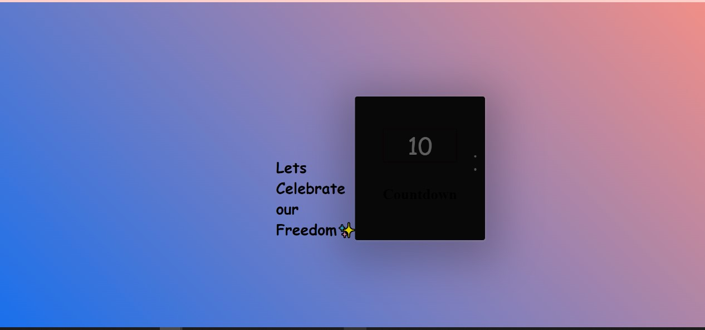
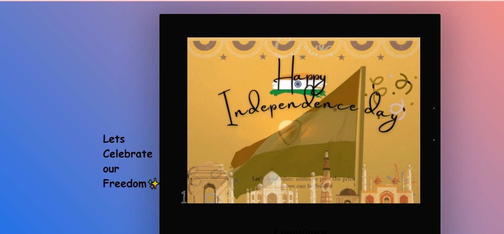

<h1>Countdown 10 - 1</h1>

To achieve the countdown background and desing used css,html. used setTimeout() function to set the timer for the function to run.
and deployed the value in browser end

<h3>Learned</h3>
<ul>
  <il>setTimeout()</il>
   <il>appendChild</il>
   <il>setAttributes</il>
  <il>addEventListner</il>
</ul>
<h2>And my output will be</h2>

